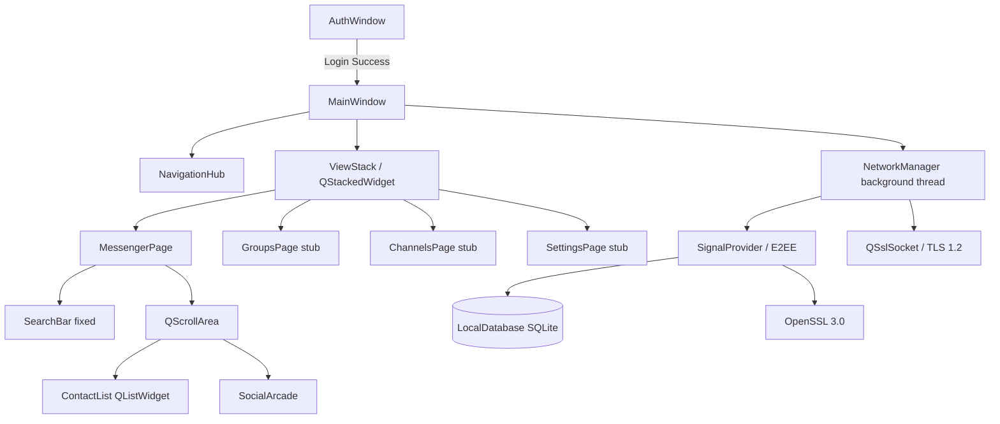

# WizzMania Client Architecture (Qt & C++) 🛡️🏗️

This document describes the current state of the WizzMania client. It is updated after every significant architectural change and serves as the authoritative reference for the UI and client-side logic.

**Last Updated**: 2026-05-01 (Post "Pro Shell" overhaul — `feature/shell-glassmorphism-rich-presence`)

---

## 1. Threading Model: The Worker Object Pattern

To ensure a buttery-smooth 60FPS UI, the WizzMania client strictly separates rendering from processing. We utilize the **Worker Object Pattern** to move all networking and heavy parsing to a background thread.

- **GUI Thread (Main)**: Dedicated solely to painting UI, handling mouse clicks, and updating widgets.
- **Network Thread (Background)**: Dedicated to TCP socket I/O, binary packet framing, and E2EE cryptography.

### 1.1 The Threading Trampoline
Communication between threads is handled via **Qt Signals & Slots** with `Qt::QueuedConnection`. To prevent data races, `NetworkManager` methods use `QMetaObject::invokeMethod` to ensure execution on the correct thread:

```cpp
void NetworkManager::sendPacket(const wizz::Packet &packet) {
  if (QThread::currentThread() != this->thread()) {
    QMetaObject::invokeMethod(this, "sendPacket", Qt::QueuedConnection, Q_ARG(wizz::Packet, packet));
    return;
  }
  // Actual network write happens only on the Network Thread
}
```

---

## 2. Integrated Security Layer (E2EE)

WizzMania implements End-to-End Encryption using the **Signal Protocol (Double Ratchet)**. This adds a persistence and crypto layer between the UI and the Network.

### 2.1 Cryptographic Persistence (`LocalDatabase`)
The client maintains a local, encrypted SQLite database to store:
- **Long-term Identity Key**: The device's unique cryptographic fingerprint.
- **One-Time PreKeys**: Keys used to facilitate asynchronous handshakes.
- **Session States**: The current Double Ratchet state for every contact, enabling Perfect Forward Secrecy.

### 2.2 OpenSSL Integration (`SignalProvider`)
We bridge `libsignal-protocol-c` to the native hardware via **OpenSSL 3.0**. The `SignalProvider` maps abstract Signal hooks to enterprise-grade AES-GCM and HMAC-SHA256 implementations.

---

## 3. Shell Architecture (Current State — Pro Shell)

### 3.1 Application Entry Point & Window Hierarchy

The application launches via `AuthWindow`, which presents the Login or Register card. Upon successful authentication, the shell transitions to `MainWindow`, which acts as the central hub.

```
Application
├── AuthWindow          (Login / Register glassmorphic cards)
└── MainWindow          (Central Hub)
    ├── Sidebar         (Avatar, navigation buttons, status)
    ├── NavigationHub   (Header with page title and actions)
    └── ViewStack       (QStackedWidget — page container)
        ├── MessengerPage
        ├── GroupsPage      (stub)
        ├── ChannelsPage    (stub)
        └── SettingsPage    (stub)
```

### 3.2 MainWindow Component Hierarchy

| Component | Class | Responsibility |
|---|---|---|
| Sidebar | (inline in `MainWindow`) | Avatar display, navigation button group, user status |
| Navigation Hub | `wizz::ui::NavigationHub` | Page title, context actions (Add Friend, etc.) |
| View Stack | `QStackedWidget` | Hosts individual page widgets |
| Messenger Page | (inline in `MainWindow`) | Contact list + Social Arcade in a Hybrid Scroll container |
| Chat Window | `ChatWindow` | Standalone floating conversation window |
| Contact List | `QListWidget` + `ContactDelegate` | Rendered contact roster with custom delegate |
| Social Arcade | `wizz::ui::arcade::SocialArcade` | Collapsible tile grid for Super App features |

### 3.3 Messenger Page: Hybrid Scroll Architecture

The Messenger page uses a **Hybrid Scroll Architecture** to prevent layout clipping:

1. **Fixed Header**: The `SearchBar` is pinned at the top of the page.
2. **Unified Scroll Container**: A single `QScrollArea` wraps both the `ContactList` and the `SocialArcade`, allowing them to scroll together as a natural vertical stack.
3. **Fixed Arcade Height**: The `SocialArcade` is constrained to a `340px` fixed height (expanded) to prevent parent-child height conflicts.

```
MessengerPage (QVBoxLayout)
├── SearchBar              ← Fixed, outside scroll
└── QScrollArea            ← Scrollable region
    └── scrollContainer
        ├── QListWidget    ← Contact list (stretch factor: 1)
        └── SocialArcade   ← Fixed 340px height
```

### 3.4 Glassmorphism Design System

All interactive surfaces follow a unified glass token set:

| Token | Value | Usage |
|---|---|---|
| Glass Background | `rgba(255, 255, 255, 25)` | Card and container fills |
| Glass Border | `1px solid rgba(255, 255, 255, 80)` | Edge definition |
| Specular Border | `1px solid rgba(255, 255, 255, 180)` | Top/leading edges for depth |
| Border Radius | `20px` (containers), `24px` (buttons) | Consistent rounding |
| Hover Accent | `rgba(100, 200, 255, 180)` | Interactive element feedback |
| Drop Shadow | `blur: 60px, color: rgba(0,60,120,100)` | Card elevation |

### 3.5 Context Menu & Interaction Policies

The `ContactList` is configured with `Qt::CustomContextMenu` policy. Right-clicking a contact triggers `MainWindow::showContactContextMenu`, which presents context-sensitive actions (Message, View Profile, Remove Friend, etc.).

All interactive controls use `Qt::PointingHandCursor` to provide affordance feedback.

### 3.6 AppContext

`AppContext` is a lightweight global state object shared across components. It currently holds the authenticated username and provides a single access point for cross-component state queries without introducing God Object coupling.

---

## 4. Integrated Security Layer (E2EE)

See section 2 above.

---

## 5. Component Diagram (Current)



---

## 6. Known Architectural Debt

The following items are tracked as technical debt to be addressed in the next refactoring cycle:

| Issue | Location | Priority |
|---|---|---|
| `MainWindow` is a partial God Object | `MainWindow.cpp` | High |
| Page layout code mixed with signal handling | `MainWindow.cpp` | High |
| No dedicated page controllers for Groups/Channels/Settings | `MainWindow.cpp` | Medium |
| Several unused lambda captures | `MainWindow.cpp` (lines 60, 827, 942) | Low |
| Groups/Channels/Settings pages are stub placeholders | `MainWindow.cpp` | Medium |
