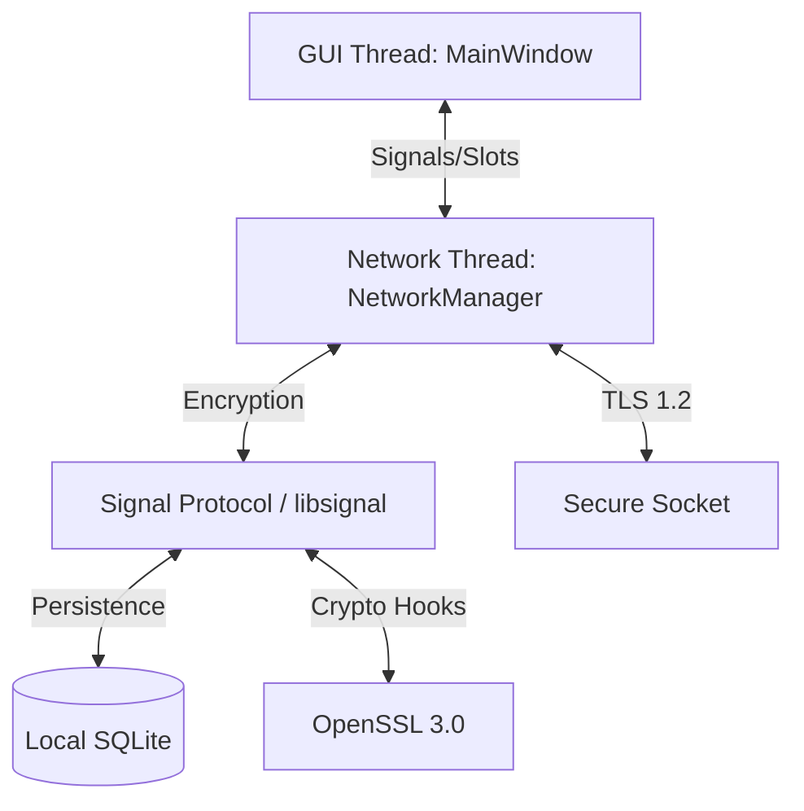

# WizzMania Client Architecture (Qt & C++) 🛡️🏗️

## 1. Threading Model: The Worker Object Pattern
To ensure a buttery-smooth 60FPS UI, the WizzMania client strictly separates rendering from processing. We utilize the **Worker Object Pattern** to move all networking and heavy parsing to a background thread.

- **GUI Thread (Main)**: Dedicated solely to painting UI, handling mouse clicks, and updating the stylesheet.
- **Network Thread (Background)**: Dedicated to TCP socket I/O, binary packet framing, and E2EE cryptography.

### 1.1 The Threading Trampoline
Communication between threads is handled via **Qt Signals & Slots** with `Qt::QueuedConnection`. To prevent data races, `NetworkManager` methods often use `QMetaObject::invokeMethod` to ensure they execute on the correct thread:

```cpp
void NetworkManager::sendPacket(const wizz::Packet &packet) {
  if (QThread::currentThread() != this->thread()) {
    QMetaObject::invokeMethod(this, "sendPacket", Qt::QueuedConnection, Q_ARG(wizz::Packet, packet));
    return;
  }
  // Actual network write happens only on the Network Thread
}
```

---

## 2. Integrated Security Layer (E2EE)
WizzMania implements End-to-End Encryption using the **Signal Protocol**. This adds a persistence and crypto layer between the UI and the Network.

### 2.1 Cryptographic Persistence (`LocalDatabase`)
The client maintains a local, encrypted SQLite database (`wizz_session.db`) to store:
- **Long-term Identity Key**: Your device's unique cryptographic fingerprint.
- **One-Time PreKeys**: Keys used to facilitate asynchronous handshakes.
- **Session States**: The current "Double Ratchet" state for every contact, allowing for Perfect Forward Secrecy.

### 2.2 OpenSSL Integration (`SignalProvider`)
We bridge `libsignal-protocol-c` to the native hardware via **OpenSSL 3.0**. The `SignalProvider` maps abstract Signal hooks to enterprise-grade AES-GCM and HMAC-SHA256 implementations.

---

## 3. Component Hierarchy
- **`MainWindow`**: The central hub displaying the Roster/Buddy List.
- **`ChatWindow`**: Self-contained conversation windows that manage their own local history and animations.
- **`NetworkManager`**: The singleton controller for the background thread and `QSslSocket` state.
- **`AudioManager`**: Handles hardware integration for recording and playing WAV-encoded voice messages.

---

## 4. Architectural Summary
By decoupling the GUI from the Network and adding a dedicated Cryptographic Persistence layer, WizzMania achieves:
- **Flawless Responsiveness**: Large binary transfers (Voice/Avatars) never freeze the UI.
- **Unbreakable Privacy**: Messages are encrypted locally before they ever touch the network stack.
- **Resilient Identity**: Cryptographic sessions persist across application restarts.


