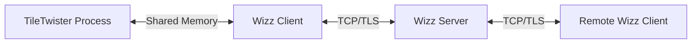

# WizzMania IPC & Games Architecture 🎮🔄

WizzMania integrates external games as separate processes that communicate with the messenger host via high-performance Inter-Process Communication (IPC).

---

## 1. The Direct-Memory Sync Model
To achieve low-latency synchronization (e.g., for real-time leaderboards and game state sharing), we avoid slow sockets or files. Instead, we use **Native Shared Memory**.

### 1.1 `NativeSharedMemory` Wrapper
We implemented a cross-platform (POSIX/Windows) RAII wrapper for shared memory:
- **Mac/Linux**: Uses `shm_open` and `mmap`.
- **Windows**: Uses `CreateFileMapping` and `MapViewOfFile`.

### 1.2 Data Integrity: `SharedMemorySync`
Every IPC packet is protected by a 4-byte **Version Counter**. 
- The Writer (Game) increments the counter after every update.
- The Reader (Messenger) peeks at the counter. If the version has changed, it re-reads the data. This provides a lock-free, read-copy-update behavior for small IPC structs.

---

## 2. Integrated Game: TileTwister
**TileTwister** (a modern 2048 clone) serves as our primary integration proof-of-concept.

### 2.1 Core Logic isolation
The game logic is separated into a pure C++ `TileTwister_Core` library (Grid, Tile, GameLogic). This allows us to:
1.  Run the actual game in an SDL2 window.
2.  Run the same logic in a headless state for integration tests.

### 2.2 IPC Payload
TileTwister periodically pushes its state into the shared memory segment:
- **Score**: Current game score.
- **Grid Snapshot**: A binary matrix representing the 4x4 board.
- **Status**: Playing, Won, Game Over.

---

## 3. Multiplayer & Relay Integration
For multiplayer games (like the proposed TicTacToe integration), the **Server** acts as the relay:
1.  **Invite**: User A sends a `GameInvite` packet via the Server.
2.  **Accept**: User B accepts, and the Server creates a `GameRoom`.
3.  **Moves**: Game packets (`PacketType::GameMove`) are relayed through the Server's `GameRouting` handler.

---

## 4. Portability & Subprojects
Existing games are managed as CMake sub-projects. The messenger root `CMakeLists.txt` automatically detects and includes them if they are present in the `games/` directory, allowing for a modular and extensible architecture.

Docs Merged:
- `Game_IPC_Architecture.md`
- `multiplayer_ipc_integration.md`
- `Feature_Games_Integration.md`
