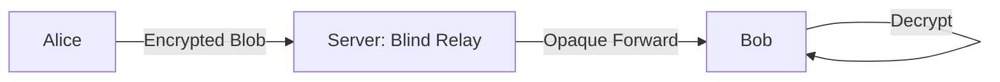
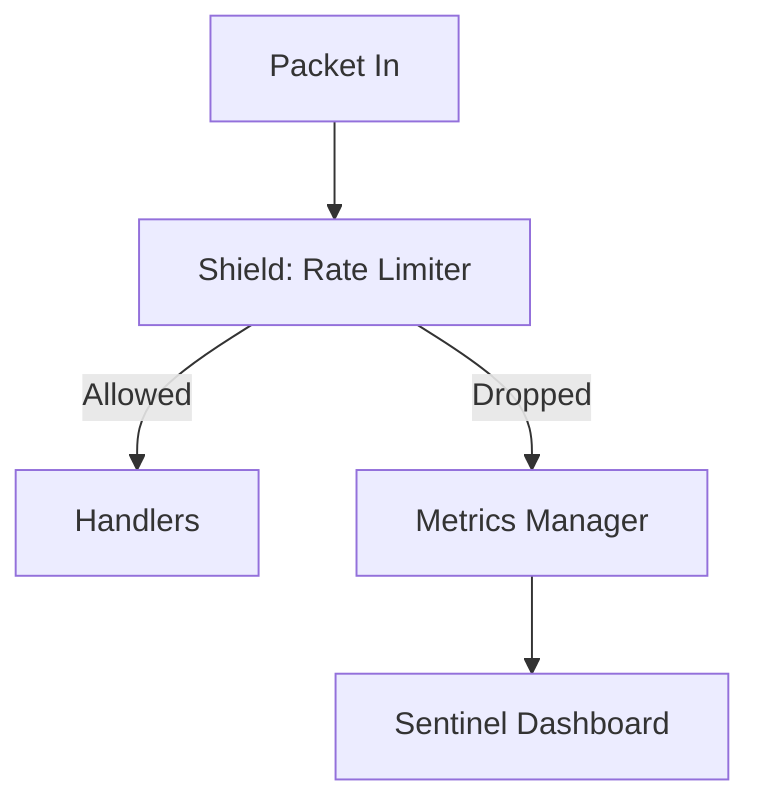

# WizzMania Security Architecture 🛡️🔐

WizzMania employs a **Defense-in-Depth** strategy to protect user data, ensure privacy, and maintain server availability. Our security model is split into three core layers: Transport, Message, and Infrastructure.

---

## 1. Transport Layer Security (TLS 1.2)
To protect against Man-in-the-Middle (MitM) attacks and network eavesdropping (e.g., on public Wi-Fi), all socket communication is wrapped in TLS 1.2.

- **Confidentiality**: All packets (headers and bodies) are encrypted using AES-256.
- **Authentication**: The Server identifies itself using an RSA Certificate (`server.crt`). 
- **Integrity**: MACs and SHA-256 hashing ensure that packets are not modified in transit.
- **Implementation**: 
    - **Server**: Uses `asio::ssl` stream wrappers.
    - **Client**: Uses `QSslSocket` with support for self-signed certificates in development.

---

## 2. End-to-End Encryption (Signal Protocol)
WizzMania provides **Zero-Knowledge** operational integrity. Even if the TLS layer were breached or the server database leaked, message content remains cryptographically protected.

### 2.1 The Double Ratchet & X3DH
We implement the Signal Protocol (`libsignal-protocol-c`) to provide:
- **Perfect Forward Secrecy**: Every message uses a unique, ratcheted key. Compromising one key does not reveal past or future messages.
- **Asynchronicity**: Users can establish a secure session even if the recipient is offline by fetching **PreKey Bundles** from the server.
- **Dynamic Deserialization Pipeline**: Due to Protocol Buffer tag overlaps where `data[0] & 0xF == 3` ambiguously maps to Handshakes and Standard Messages, the client uses a fault-tolerant multi-pass deserializer. It natively tries to parse standard `SignalMessage` blobs first, safely falling back to `PreKeySignalMessage` upon Protobuf parsing failure. This explicitly prevents false Protobuf errors (`-1100`) from erroneously triggering session teardowns.

### 2.2 Blind Relay Model
The server acts as a **Blind Relay**. It facilitates the exchange of public key bundles and forwards `E2EMessage` blobs without ever possessing the private keys needed to decrypt them.

---

## 3. Infrastructure Protection (Shield Phase)
The **Shield** layer protects the server from Denial of Service (DoS) and brute-force attacks using a **Token Bucket** algorithm.

### 3.1 Dual-Layer Rate Limiting
| Layer | Target | Mechanism |
|-------|--------|-----------|
| **Connection** | IP Address | Drops socket **before** TLS handshake if connection rate is too high. |
| **Command** | Session | Drops specific packets (Nudges, IMs) if a user exceeds the command threshold. |

- **Burst Capacity**: Allows short bursts of activity (e.g., 10 messages) while enforcing a long-term average (e.g., 3 per second).

---

## 4. Observability & Monitoring (Sentinel Phase)
The **Sentinel** phase provides real-time visibility into the security state of the server via an **FTXUI** dashboard.

- **Metrics Manager**: A lock-free system using `std::atomic` counters to track:
    - Failed login attempts.
    - Active Shield drops (blocked connections).
    - Data throughput (Bytes In/Out).
- **Command Processor**: Allows administrators to globally broadcast system messages or gracefully shut down the server during a security event.

