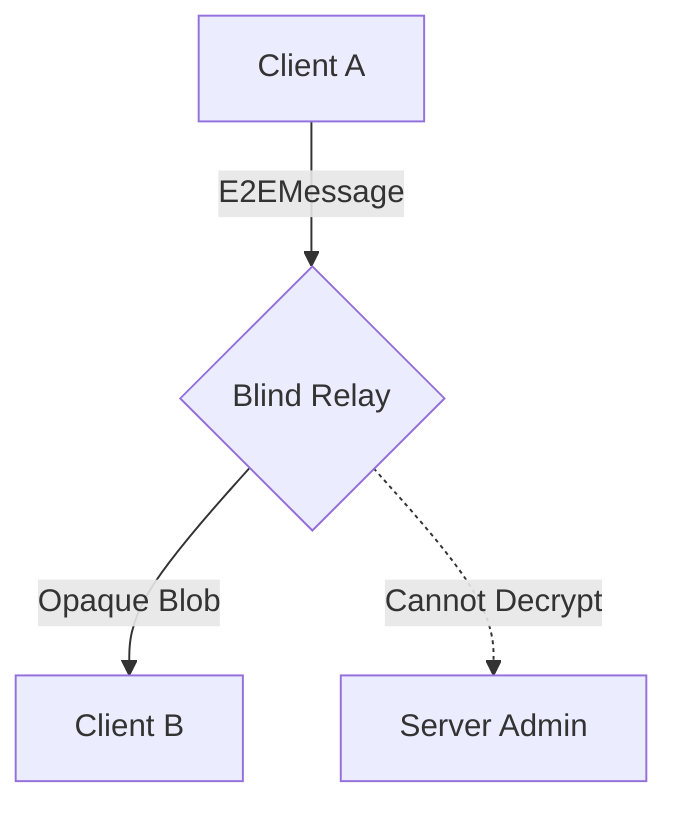

# WizzMania Server Architecture & Protocol 🛡️🏗️

## 1. Overview
The WizzMania Server (`server/`) is an **Asynchronous Event-Driven Architecture** built on the Proactor Pattern. It handles thousands of concurrent clients by delegating I/O multiplexing to the operating system (epoll/kqueue/IOCP).

### 1.1 Technology Choice: Standalone Asio (v1.30.2)
We utilize **Standalone Asio** to achieve enterprise-grade scalability. 
- **O(1) Scaling**: Unlike legacy `select()`, Asio's efficiency remains constant as connection count grows.
- **Resource Efficiency**: Idle connections consume zero CPU time; threads only wake when hardware interrupts signal incoming data.
- **Zero-Block Philosophy**: All network interactions are non-blocking, ensuring the server never stalls on a single slow client.

---

## 2. Core Components

### 2.1 The Reactor/Proactor Loop (`io_context`)
The heart of the server is `asio::io_context`. Instead of a "Thread-per-client" model that buckles under context-switching overhead, we use a single lightweight execution thread (or a small pool) to pump the event loop.

### 2.2 Session Management (`ClientSession`)
Every connected user is encapsulated in a `ClientSession`, managed via `std::shared_ptr` and `std::enable_shared_from_this`.
- **Memory Safety**: By binding a `shared_ptr` to async callbacks, we ensure the session object remains in RAM as long as an operation is pending, even if the user disconnects mid-packet.

### 2.3 Modular Database Architecture (Facade & DAO)
Disk I/O is slow and business logic varies by domain. To maintain a responsive server, we utilize a **Facade Pattern** backed by domain-specific **Data Access Objects (DAOs)**.

1.  **DatabaseManager (The Facade)**: Acts as the unified interface and orchestrator. It manages the `sqlite3` connection lifecycle and the background **Actor Model** worker thread.
2.  **Domain DAOs**: SQL logic is partitioned into specialized classes to ensure the **Single Responsibility Principle**:
    - **AuthDAO**: Handles user credentials, password hashing (SHA-256 + Salt), and registration.
    - **SocialDAO**: Manages the social graph (Friends/Followers), message persistence, user avatars, and status messages.
    - **CryptoDAO**: Manages the Zero-Knowledge E2EE key registry (Identity Keys and Pre-Key bundles).
3.  **Task Orchestration**: 
    - The Asio network loop posts a task (lambda) to the **DatabaseManager**.
    - The Manager delegates the work to a background worker thread using the appropriate DAO.
    - Upon completion, the result is **posted back** to the network `io_context` to safely dispatch the response.

### 2.4 Data Normalization & Case-Sensitivity
To maintain display aesthetics while preserving robust routing logic across components (Friends, E2EE keys, Logins), the system utilizes a **Dual-Layer Case Hierarchy**:
- **Application Layer**: Usernames retain exactly the client's original casing strings (e.g., `Mr Krab`) for UI presentation.
- **Data Layer**: All underlying relational SQL bounds map via `LOWER(USERNAME) = LOWER(?)`. This categorically locks maliciously identical names (e.g., `mr krab` vs `Mr Krab`) from colliding in the database, eliminating "User Not Found" lookup divergence.

---

## 3. The WizzMania Binary Protocol

### 3.1 Packet Structure (12-Byte Header)
All communication happens via a custom bit-packed format to minimize bandwidth.

```cpp
struct PacketHeader {
    uint32_t magic;  // 0xCAFEBABE (Sentinel to verify protocol integrity)
    uint32_t type;   // Operation ID (Registration, Message, E2EE, etc.)
    uint32_t length; // Size of the Body in bytes
};
```

### 3.2 Endianness (Network Byte Order)
To ensure Mac, Windows, and Linux clients can talk regardless of their CPU architecture:
- **Writing**: We use `htonl` to convert host-native integers to Big-Endian before transmission.
- **Reading**: We use `ntohl` to convert incoming bytes back to the native format.

---

## 4. Packet Processing & Safety

### 4.1 Fragmentation Handling
TCP is a stream, not a packet protocol. We often receive partial headers or multiple messages in one `recv`.
1.  **Accumulate**: Append raw bytes to a persistent `std::vector` buffer.
2.  **Peeking**: Check if the buffer has >= 12 bytes.
3.  **Validation**: Verify the `magic` number. If invalid, drop the connection immediately (potential attack).
4.  **Slicing**: If `buffer.size() >= 12 + length`, move the data into a `Packet` object and shift the remaining bytes to the front.

### 4.2 Security: Buffer Overflow & DoS Prevention
- **Bounds Checking**: Every `readInt()` or `readString()` call verifies against the actual size of the payload.
- **MAX_PACKET_SIZE**: The server rejects any header claiming a body larger than 10MB to prevent memory exhaustion attacks.

---

## 5. Messaging & Relay Logic

### 5.1 The Hub Pattern
The Server acts as a **Central Hub**. Sessions are stateless regarding neighbors; they only know how to talk to the Hub.
- **Routing**: Server maintains an `OnlineUsers` map.
- **Store-and-Forward**: If a recipient is offline, the message is persisted to SQLite with `delivered=0` and automatically pushed upon their next login.

### 5.2 Zero-Knowledge E2EE Relay
For E2EE messages, the server acts as a **Blind Relay**.
- **Transparent Routing**: It reads the `target` username header.
- **Opaque Payloads**: It forwards the `ciphertext` blob without decrypting it. The server never possesses the keys to the message content.


