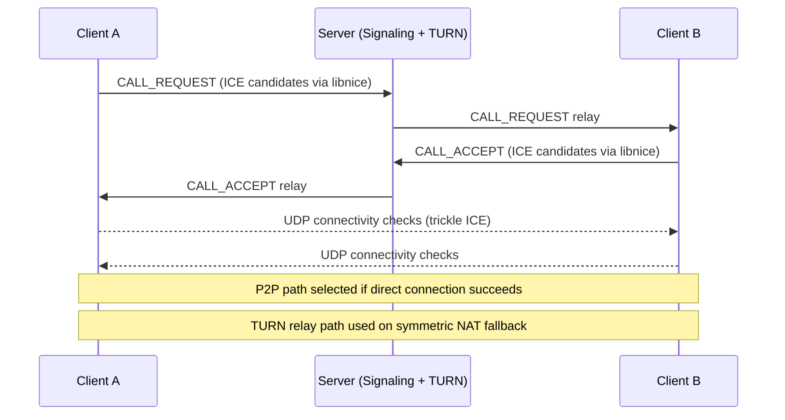
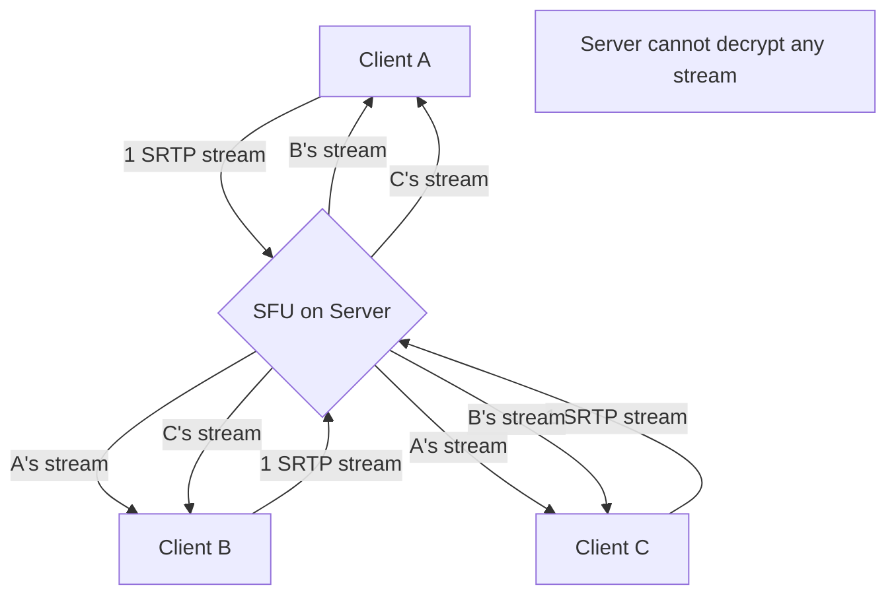

# WizzMania Audio & Video Calls — Feature Specification 📞🎥

**Pillar Alignment**: Pillar 1 (The Shield — SRTP/ZRTP) + Pillar 3 (The Ghost — UDP Transport, TURN/STUN)
**Status**: Specified — Pending Implementation
**Last Updated**: 2026-05-09 (Decisions locked after architecture review)

---

## Overview

| Dimension | Audio Call | Video Call |
|---|---|---|
| **Transport** | UDP (P2P preferred, TURN fallback) | UDP (P2P preferred, TURN fallback) |
| **Codec (Audio)** | Opus | Opus |
| **Codec (Video)** | — | H.264 Baseline (hardware-native encoder only) |
| **Encryption** | DTLS-SRTP | DTLS-SRTP |
| **Group Calls** | Up to 8 participants (SFU) | Up to 4 participants (SFU) |
| **NAT Traversal** | Full RFC 8445 ICE via `libnice` | Full RFC 8445 ICE via `libnice` |
| **Max Latency Target** | < 150ms glass-to-glass | < 200ms glass-to-glass |
| **Call History** | Separate call log | Separate call log |

---

## 1. Guiding Principle: Server is a Fallback, Never the Default

In a server-mediated media model, Alice's voice travels:
```
Alice → [Server decrypts / re-encrypts] → Bob
```
Even with SRTP, the server terminates the UDP session and is therefore a decryption point — it can intercept, record, or analyze every call.

In our **P2P-first model**, media travels:
```
Alice ──[DTLS-SRTP, keys negotiated end-to-end]──────────── Bob
```
The server sees only **signaling metadata** (who called whom, duration). The DTLS keys are negotiated directly between peers — the server has no copy and cannot decrypt the stream.

The TURN relay is engaged **only** when NAT topology prevents direct UDP traversal (~15–20% of real-world connections: symmetric NAT, corporate firewalls). It is a safety net, not a default route.

---

## 2. Connection Architecture

### 2.1 Signaling vs. Media Plane Separation

| Plane | Protocol | Transport | Purpose |
|---|---|---|---|
| **Signaling** | Custom WizzMania opcodes | TCP/TLS (existing connection) | Call setup, teardown, ICE candidate exchange |
| **Media** | RTP/SRTP | UDP | Audio/video stream |

### 2.2 ICE: Full RFC 8445 via `libnice`

Our initial spec described a "simplified ICE-like process." With the decision to implement SFU from day one, **full RFC 8445 ICE compliance is required**. A proper SFU must:
- Handle all NAT types including symmetric NAT.
- Support trickle ICE (incremental candidate delivery) for call setup < 2 seconds.
- Participate as a full ICE agent in connectivity checks.

Rather than implementing ICE from scratch (thousands of lines of spec-compliant code with high risk of bugs), we integrate **`libnice`** — a production-grade, LGPL-licensed GLib-based ICE library used in production by WebRTC implementations.

**Integration approach**: `libnice` is compiled as a static library and its candidate-gathering and connectivity-check callbacks are bridged to our Asio event loop via `QMetaObject::invokeMethod` for thread safety.



### 2.3 TURN Server: Separate `coturn` Instance

**Decision**: Deploy TURN as a separate `coturn` process, not embedded in the WizzMania server binary.

**Trade-off analysis:**

| | Embedded | Separate `coturn` |
|---|---|---|
| Deployment | Single binary | Two processes to deploy and monitor |
| Stability | A TURN bug/crash takes down messaging | Independent crash isolation — a TURN outage degrades calls but never messaging |
| Scaling | Cannot scale TURN independently | TURN (bandwidth-heavy) scales independently from messaging (CPU-heavy) |
| Implementation cost | Must implement RFC 5766 correctly ourselves | `coturn` is production-proven (used by Signal, Matrix, Jitsi) — zero implementation cost |
| Single Responsibility | Violates SRP — one binary handles two unrelated protocols | Each process has one responsibility |
| Security | A TURN exploit is also a messaging server exploit | Blast radius is contained to the TURN process |

**Rationale**: Embedding TURN violates the Single Responsibility Principle and introduces unacceptable coupling: a memory corruption bug in the TURN UDP handler could crash the entire messaging server, taking down all active sessions. `coturn` is production-battle-tested at the scale of Signal and Matrix. The operational complexity of running a second process is a worthwhile trade-off for stability, security, and correct separation of concerns.

**Integration**: `coturn` authenticates WizzMania clients via a **shared-secret HMAC** mechanism (RFC 5389). The WizzMania server generates time-limited TURN credentials per session and delivers them to clients via the signaling channel. Clients never communicate with `coturn` directly without a valid credential.

---

## 3. Audio Calls

### 3.1 Codec: Opus
- Variable bitrate: 6 kbps (narrow-band) to 510 kbps (high-fidelity).
- Built-in FEC: recovers from up to 10% packet loss without retransmission.
- Built-in VAD: stops transmitting during silence, saving bandwidth.
- **Target configuration**: VOIP mode, 32 kbps adaptive, 20ms frames, FEC enabled.

### 3.2 Audio Pipeline
```
Microphone → QAudioSource → PCM Buffer → Opus Encoder → RTP Packetizer → SRTP → UDP
UDP → SRTP → RTP Depacketizer → Opus Decoder → PCM Buffer → QAudioSink → Speakers
```
The entire pipeline runs on a **dedicated Audio Thread**, never the GUI thread.

### 3.3 Audio Processing: WebRTC APM

**Decision**: Integrate the WebRTC Audio Processing Module (APM).

**Trade-off analysis:**

| | WebRTC APM | Custom DSP |
|---|---|---|
| AEC quality | Battle-tested (10+ years, Google) | High risk of audible echo artifacts |
| Binary size | +8–12MB | +0MB |
| Implementation time | Integration only (~1 week) | 6–12 months for production-quality AEC |
| Build complexity | Separate GN/Ninja build → static lib | Integrated in CMake |
| Maintenance | Upstream updates available | Self-maintained |

**Rationale**: AEC is a graduate-level DSP problem. Poor AEC quality produces audible echo that makes the app feel amateurish. The +10MB binary cost is a sound investment. We build WebRTC APM as a static library and bridge it via a thin C++ wrapper.

Features provided: Acoustic Echo Cancellation (AEC), Automatic Gain Control (AGC), Noise Suppression (NS).

---

## 4. Video Calls

### 4.1 Codec: H.264 Baseline (Hardware-Native Only)

**Decision**: Hardware-native encoder only. No software fallback.

- **macOS**: VideoToolbox (native, zero licensing concern).
- **Windows**: DXVA2 / Media Foundation (native).
- **Linux**: VA-API or NVENC (hardware required; software H.264 is excluded to avoid LGPL/GPL concerns).

If the hardware encoder is unavailable, the video call degrades gracefully to audio-only mode with a user notification.

**Future migration target**: AV1 (royalty-free, superior compression, increasingly hardware-accelerated).

**Configuration**: Baseline Profile, 720p @ 30fps (adaptive down to 480p), 1.5 Mbps adaptive bitrate, 2s keyframe interval.

### 4.2 Video Pipeline
```
Camera → QMediaCaptureSession → Raw Frames → H.264 HW Encoder → RTP Packetizer → SRTP → UDP
UDP → SRTP → RTP Depacketizer → H.264 HW Decoder → Frame Buffer → QVideoSink → VideoWidget
```

### 4.3 Adaptive Bitrate (ABR)
Driven by RTCP Receiver Reports:
- Packet loss > 5%: reduce bitrate by 20%.
- Packet loss < 1% for 10s: increase bitrate by 10% (up to max).
- Packet loss > 20%: drop to audio-only, notify user.

---

## 5. Group Calls: SFU Architecture

**Decision**: Implement SFU from day one. No mesh phase.

### 5.1 Why SFU over Mesh

Mesh (every participant connects to every other) costs O(N²) upstream bandwidth from each device. At 4 participants, each person sends 3 streams — already straining mobile uplinks. An SFU costs O(1) upstream per participant regardless of group size.

### 5.2 SFU Design: Zero-Knowledge Forwarding

The SFU runs within the WizzMania server process:
- Each participant sends **one encrypted SRTP stream** to the SFU.
- The SFU **selectively forwards** streams to other participants without decryption.
- The SFU forwards encrypted SRTP packets opaquely — it holds no DTLS keys.
- This is the architecture used by Signal, Discord, and Google Meet.



**Capacity**: Up to 8 audio participants, up to 4 video participants (hardware encoding limitation).

---

## 6. Encryption: DTLS-SRTP

1. **DTLS 1.2 Handshake**: Performed over the UDP media socket after P2P/SFU connection is established. Produces shared SRTP master keys negotiated end-to-end — server holds no copy.
2. **SRTP**: AES-128-CM with HMAC-SHA1 authentication for all media streams.
3. **Key Verification**: Optional DTLS fingerprint comparison (Safety Number) to detect MITM attacks — identical concept to Signal's Safety Numbers.

**Why not reuse the Signal Protocol (Double Ratchet) for calls?** The Double Ratchet is designed for asynchronous messaging with persistent ratchet state. DTLS-SRTP is the industry standard for real-time synchronous media with negligible per-call handshake overhead. They are complementary, not interchangeable.

---

## 7. Call Log

**Decision**: Missed and completed calls are logged in a **dedicated call log**, separate from chat history.

The call log stores: contact, direction (inbound/outbound), timestamp, duration, outcome (answered/missed/declined). It is accessible from a dedicated section in the Settings page.

---

## 8. Protocol Extensions (Signaling — TCP)

| Opcode | Direction | Description |
|---|---|---|
| `CALL_REQUEST` | Client → Server → Client | Initiate call, carry ICE candidates |
| `CALL_ACCEPT` | Client → Server → Client | Accept call, carry ICE candidates |
| `CALL_DECLINE` | Client → Server → Client | Decline call |
| `CALL_END` | Client → Server → Client | Terminate active call |
| `CALL_BUSY` | Server → Client | Callee is in another call |
| `CALL_ICE_CANDIDATE` | Client → Server → Client | Trickle ICE candidate exchange |
| `CALL_VIDEO_TOGGLE` | Client → Server → Client | Camera on/off notification |
| `CALL_MUTE_TOGGLE` | Client → Server → Client | Microphone on/off notification |

---

## 9. Dependencies

| Library | Purpose | License |
|---|---|---|
| `libnice` | Full RFC 8445 ICE + STUN/TURN | LGPL |
| Opus | Audio codec | BSD |
| `libsrtp2` | SRTP encryption | BSD |
| OpenSSL 3.0 | DTLS handshake | Apache 2.0 |
| WebRTC APM | AEC, AGC, Noise Suppression | BSD |
| Qt Multimedia | Camera, microphone, audio/video I/O | LGPL |

---

## 10. Architectural Decisions Log

| Decision | Choice | Rationale |
|---|---|---|
| ICE Implementation | Full RFC 8445 via `libnice` | SFU requires full ICE compliance |
| TURN Deployment | Separate `coturn` instance | SRP, crash isolation, proven at Signal/Matrix scale; HMAC shared-secret auth |
| Audio Processing | WebRTC APM | AEC quality non-negotiable; implementation cost too high |
| Video Codec | H.264 hardware-native only | No licensing risk; graceful audio-only fallback |
| Group Call Architecture | SFU from day one | O(1) upstream per client; no mesh regression later |
| Call History | Separate call log | Clean separation from chat history |
