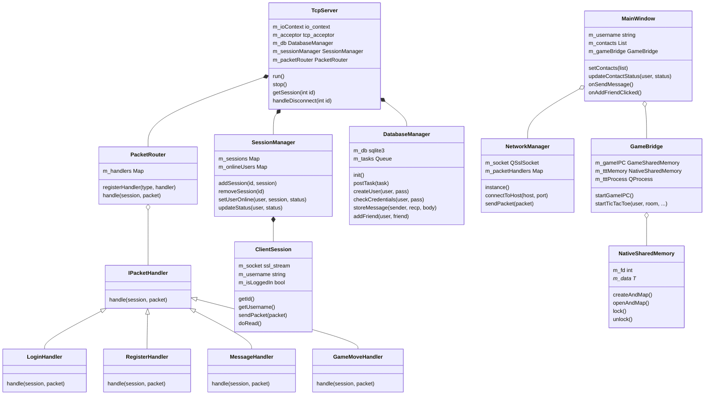

# WizzMania Technical Class Diagram (Low-Level)

> [!NOTE]
> This diagram is 100% accurate to the refactored C++ code. The dynamic version is available in the presentation under `mermaid_view.html`.
