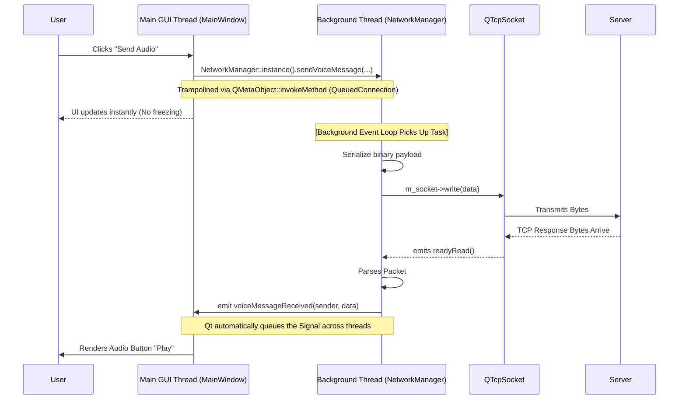

# Client Architecture (Qt & C++)

## 1. Threading Model: The Worker Object Pattern (Phase 1 Refactor)
Unlike the Server, which currently uses `select()` for I/O multiplexing, the Client relies heavily on **Qt's Event Loop**, but it operates in a strict multi-threaded capacity to ensure flawless GUI responsiveness.

### Design Choice: Network/GUI Thread Separation
In the original MVP, `QTcpSocket` ran on the main GUI thread. While non-blocking, parsing large payloads (like Avatars or Voice Messages) still monopolized the main thread's CPU time, causing UI stutter.
We resolved this by migrating `NetworkManager` fully to a background `QThread` using the **Worker Object** pattern.

*   **GUI Thread (Main):** Dedicated solely to painting UI, handling mouse clicks, and reacting to user input.
*   **Network Thread (Background):** Dedicated to TCP socket I/O, binary packet framing, and deserialization.

### Architectural Pattern: Queued Connections & Trampolines
Because `NetworkManager` and the UI (e.g., `MainWindow`) live on *different* threads, they must not invoke each other's methods directly (which causes data races and crashes). They communicate elegantly via **Qt Signals & Slots with `Qt::QueuedConnection`**.

When the GUI wants to send a packet, it calls `NetworkManager::sendPacket()`. Inside this method, we implemented a **Threading Trampoline**:

```cpp
void NetworkManager::sendPacket(const wizz::Packet &packet) {
  // 1. Thread Check: Are we being called from the GUI thread?
  if (QThread::currentThread() != this->thread()) {
    // 2. Trampoline: Package this method call and put it in the Network Thread's Event Queue
    QMetaObject::invokeMethod(this, "sendPacket", Qt::QueuedConnection,
                              Q_ARG(wizz::Packet, packet));
    return; // 3. The GUI Thread returns instantly!
  }
  
  // 4. Actual execution (This now ONLY runs on the Network Thread)
  if (!isConnected()) return;
  std::vector<uint8_t> data = packet.serialize();
  m_socket->write(reinterpret_cast<const char *>(data.data()), data.size());
}
```

### Diagram: Multi-Threaded Architecture


## 2. The `NetworkManager` Lifecycle
We do **not** inherit from `QThread`. We use composition to preserve thread safety.

### Singleton Initialization
The Singleton is instantiated exactly once, moved to a raw `QThread`, and the underlying socket is created *only after* the thread starts mapping to the new event loop.

```cpp
NetworkManager &NetworkManager::instance() {
  static NetworkManager* _instance = nullptr;
  if (!_instance) {
    QThread* thread = new QThread();
    _instance = new NetworkManager();
    _instance->moveToThread(thread); // Push object to background thread
    // Safely init socket on the new thread's context
    QObject::connect(thread, &QThread::started, _instance, &NetworkManager::initSocket);
    thread->start();
  }
  return *_instance;
}
```

### Implicit MetaType Registration
To allow Qt to pass complex C++ types (like `wizz::Packet` or `std::vector<uint8_t>`) through a `QueuedConnection` between the background thread and the GUI thread, the types must be registered.
We leverage Qt 6's MOC (Meta Object Compiler) which implicitly registers signal arguments, supported by explicit registrations in the constructor:
```cpp
qRegisterMetaType<wizz::Packet>("wizz::Packet");
qRegisterMetaType<std::vector<uint8_t>>("std::vector<uint8_t>");
```

## 3. GUI & Application Features
The GUI is built using **Qt Widgets** (not QML) for maximum native performance and desktop integration.

### Class Structure
*   **`MainWindow`**: The "Roster" or "Buddy List".
    *   Manages the list of friends.
    *   Listens to `NetworkManager::packetReceived` for status updates (Online/Busy).
    *   Spawns `ChatWindow` instances when a friend is clicked.
*   **`ChatWindow`**: The conversation view.
    *   **Self-Contained**: Manages its own layout, message history, and animations.
*   **`AudioManager`**: Hardware Integration.
    *   Wraps `QAudioSource` and `QAudioSink` for recording/playback.
    *   Handles injecting standard `.WAV` headers onto raw PCM device data so voice messages can be serialized cross-platform.

### UX Responsiveness Guaranteed
Because of the Phase 1 Threading overhaul, if a user receives a 5 MB Avatar upload, the `std::vector` copy and packet framing all happens out of sight on `Net_Thread`. The `GUI_Thread` continues rendering at 60FPS. Neither thread requires `std::mutex` locking, as State remains fiercely isolated by Qt's event-driven Queued Connections.
