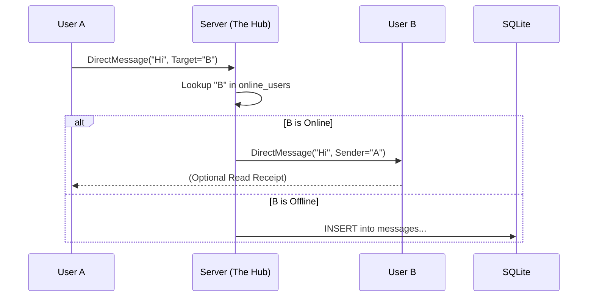

# Server Architecture & Concurrency Model

## 1. Overview
The Wizz Mania Server (`server/`) is designed as an **Asynchronous Event-Driven Architecture** (Proactor Pattern).
It uses **Standalone Asio (v1.30.2)** to handle thousands of concurrent clients without the massive overhead of "one-thread-per-client". It achieves this by delegating I/O multiplexing natively to the underlying OS (e.g., `epoll` on Linux, `kqueue` on macOS, IOCP on Windows).

---

## 2. Design Choice: Single-Threaded vs. Multi-Threaded

### Option A: Thread-Per-Client (Rejected)
*   **Mechanism:** `accept()` a connection -> `std::thread(handle_client).detach()`.
*   **Pros:** Easy to write conceptually (linear code).
*   **Cons:**
    *   **Race Conditions:** If User A sends a message to User B, Thread A works on Socket B. If Thread B disconnects at the same time, we have a crash. Requires complex Locking (`std::mutex`).
    *   **Resource Heavy:** 1,000 clients = 1,000 threads. Heavy confusing context switching for the OS.

### Option B: Asynchronous Event Loop / Asio (Selected)
*   **Mechanism:** A core `asio::io_context` runs an event loop. Network operations (`async_read_some`, `async_write`) are queued, and the OS notifies the `io_context` when data is ready. The `io_context` then executes our custom C++ lambda callbacks.
*   **Pros:**
    *   **Scalability:** Non-blocking operations scale seamlessly to thousands of connections.
    *   **Efficient:** Idle connections consume practically zero CPU, only waking up when bytes physical hit the network interface.
    *   **Memory Safe:** Integrates perfectly with C++11 `std::shared_ptr` to manage session lifecycles automatically.

---

## 3. Real World Industry Examples

### WhatsApp (Erlang Model)
WhatsApp does not use C++ threads directly. It uses **Erlang Processes** (Green Threads).
*   **Architecture:** Massive scaling. One tiny "Actor" process per user.
*   **Why:** If one user crashes, it doesn't affect the million others. Erlang is built for Telecom reliability.

### Telegram / Modern C++ Servers (Redis, Node.js, Envoy)
High-performance servers typically use **Event Loops**, scaled across CPU cores (Multi-Reactor).
*   **Redis / Node.js:** Strictly Single-Threaded Event Loop.
*   **Envoy Proxy / Nginx:** A pool of worker threads (e.g., 8 threads for 8 CPUs). **Each worker** runs its own Single-Threaded Event Loop.

### Why Wizz Mania uses Asio (Senior Analysis)
Our server mimics the Nginx/Node.js Proactor model using C++ Asio. We have a primary network `io_context` thread. 

#### Q1: "If 5,000 users are idle, how much CPU should they consume?"
*   **The Answer:** **Near Zero.**
*   **The "Event Loop" Advantage:** We tell the OS "Wake me up if socket 4022 receives data." Until then, our thread sleeps. 5,000 idle users cost us nothing but a bit of RAM for the socket buffers.

#### Q2: "What about heavy tasks like Database Queries?"
*   **The Caveat:** Event Loops *cannot* do strict Blocking IO (long DB queries), or they starve the entire network. 
*   **The Threaded Database Solution:** Wizz Mania explicitly isolates Database Queries by spawning standalone `std::thread` workers for disk I/O. When the disk finishes reading, it safely re-injects the response back into the main Asio loop via `asio::post()`.

---

## 4. Implementation Plan (Asio Architecture)
We implement a wrapper class `TcpServer` covering:
*   `asio::ip::tcp::acceptor` (Listens for incoming connections)
*   `asio::io_context::run()` (The Core Event Pump)
*   `wizz::ClientSession` (Wrapped in `std::shared_ptr` for memory safety during asynchronous lambda execution)

## 5. The "Asynchronous Socket Dance"
To establish a highly concurrent listening server with Asio:

1.  **Initialize Context**: Create the `asio::io_context` (The reactor pump).
2.  **Bind & Listen Setup**: Initialize `asio::ip::tcp::acceptor(m_ioContext, endpoint)`.
3.  **Recursive Async Accept**:
    ```cpp
    void TcpServer::doAccept() {
      m_acceptor.async_accept([this](asio::error_code ec, asio::ip::tcp::socket socket) {
        if (!ec) {
          int sessionId = m_nextSessionId++;
          auto session = std::make_shared<ClientSession>(sessionId, std::move(socket), ...);
          m_sessions[sessionId] = session;
          session->start(); // Triggers the first async_read
        }
        doAccept(); // Immediately queue up the next accept() asynchronously!
      });
    }
    ```

## 6. Data Processing: "The Pump"
To handle TCP fragmentation (partial packets), we implement a buffering strategy in `ClientSession`:

1.  **Accumulate:** Append all incoming bytes (`recv`) to a persistent `std::vector` buffer.
2.  **Pump Loop:**
    *   **Check 1:** Is buffer size >= Header Size (12 bytes)? If no, wait.
    *   **Peek:** Read the `BodyLength` from the header.
    *   **Check 2:** Is buffer size >= Header + BodyLength? If no, wait.
    *   **Extract:** Copy the full packet data, create a `Packet` object.
    *   **Consume:** Remove the processed bytes from the buffer (O(N) shift, but acceptable for <10KB packets).
    *   **Repeat:** Continue loop until buffer is empty or partial.

## 8. Messaging Architecture (The Hub Pattern)
To enable 1-to-1 messaging (User A -> User B), we treat the Server as the **Central Hub**.
*   **Problem:** `ClientSession A` is isolated. It has no pointer to `ClientSession B`.
*   **Naive Solution:** Give A a pointer to B.
    *   *Risk:* If B disconnects, A holds a **Dangling Pointer**. Crash.
*   **The Hub Solution:**
    1.  **Registry:** The Server maintains a Global Map: `std::unordered_map<std::string, ClientSession*> online_users`.
    2.  **Routing:**
        *   A sends `[Target="B", Msg="Hi"]` to Server.
        *   Server looks up "B" in `online_users`.
        *   If found: Server calls `B->send()`.
        *   If not found: Server stores message in DB (Offline).

### Diagram: The Hub Pattern


*   **Source of Truth:** The Server is the *only* entity that knows who is online. Sessions are stateless regarding neighbors.

## 9. Session Registry Implementation (Callbacks)
To implement the "Hub Pattern" without tight coupling or circular dependencies, we use Modern C++ callbacks (`std::function`).
1.  **The Registry:** `TcpServer` holds `std::unordered_map<std::string, ClientSession*> m_onlineUsers`.
2.  **The Callback:** `ClientSession` holds a `std::function<void(ClientSession*)>` called `m_onLoginSuccess`.
3.  **The Flow:**
    *   `TcpServer` creates `ClientSession` and passes a lambda: `[this](ClientSession* s) { m_onlineUsers[s->getUsername()] = s; }`.
    *   When `ClientSession` authenticates (Login/Register), it invokes `m_onLoginSuccess(this)`.
    *   `TcpServer` receives the signal and updates the Registry.
This ensures `ClientSession` does not need to know about `TcpServer`, preserving the hierarchy.

## 10. Message Routing Logic
Messages (PacketType::DirectMessage) are routed using a similar callback pattern:
1.  User A sends `[Target="B", Msg="Hi"]`.
2.  `ClientSession` A reads the target and invokes `m_onMessage(this, "B", "Hi")`.
3.  `TcpServer` (the Router) looks up "B" in the `OnlineMap`.
4.  If B is found: Server constructs a packet `[Sender="A", Msg="Hi"]` and calls `B->sendPacket()`.
5.  If B is not found: The message must be stored for later delivery (See Section 11).

## 11. Offline Messaging (Implemented)
If the target user is not online, the message cannot be delivered immediately.
*   **Requirement:** Persistent storage of undelivered messages.
*   **Mechanism:**
    *   Server inserts message into a `messages` table in SQLite: `(sender, recipient, body, timestamp, delivered=0)`.
    *   Server flushes pending messages to B and marks them as `delivered=1`.

## 12. Architectural Trade-offs & Future Scaling
As a prototype, Wizz Mania makes certain simplifications. In a production environment (WhatsApp/Telegram scale), these would be addressed as follows:

### A. Privacy (Plaintext vs. E2EE)
*   **Current:** Messages are stored in plaintext in `wizzmania.db`. An admin can read them.
*   **Production (E2EE):** Keys are generated on Client A and Client B. The Server only relays encrypted blobs (`0xDEADBEEF...`). The Server *cannot* read the messages even if it wanted to.

### B. Scalability (Blocking I/O vs. DB Thread)
*   **Current State:** Wizz Mania isolates database reads (e.g. `handleLogin`) by throwing the workload onto a detached `std::thread`. To avoid Race Conditions returning results, the background thread calculates passwords, then safely invokes `TcpServer::postResponse()`.
*   **Asio Integration (`postResponse`):**
    *   The Database thread invokes `asio::post(m_ioContext, std::move(lambdaCallback))`.
    *   This legally and safely schedules the database's callback back onto the main networking event loop. 
    *   This instantly eliminates Head-Of-Line blocking while circumventing the need for crude vectors and mutex locks entirely.

### C. Consistency (Push vs. Sync)
*   **Current (Push):** Server pushes a message to the active socket. "Fire and forget."
    *   *Risk:* Multi-device inconsistency. Dealing with packet loss is harder.
*   **Production (Sync):** Client tracks `LastMessageID`.
    *   On connection, Client asks: "Give me everything after ID 1005."
    *   Server sends the "Delta". Ensures 100% consistency across all devices.

### D. Flow Control (Pagination vs. Head-of-Line Blocking)
*   **Problem:** If a user has 50,000 pending offline messages, sending them all at once inside the Login Callback would block the Main Event Loop for seconds, freezing the server for everyone else.
*   **Current Solution (Safety Cap):** `fetchPendingMessages` forces a `LIMIT 50`. We send the oldest 50 undelivered messages.
*   **Production (Pagination):**
    *   Server sends a batch (e.g., 50).
    *   Client UI shows a "Load More" button (or auto-scrolls).
    *   Client sends `RequestHistory(Offset=50)` to fetch the next batch.
    *   This keeps the Server responsive (Time-slicing).


## 13. Feature Specifics: Wizz (Nudge) Routing
The Wizz feature introduces a "Stateful" check before routing.
*   **Logic:**
    1.  Sender sends `Nudge`.
    2.  Server checks Recipient's **Status**.
    3.  If Status == `Busy`: Server sends `PacketType::Error` ("User is busy") back to Sender. **Dropping the Wizz.**
    4.  If Status == `Online`: Server routes `Nudge` to Recipient.
*   This illustrates **Server-Side Validation**. The client UI also disables the button, but the Server enforces the rule (anti-cheat).

## 15. Voice Messaging Architecture (Binary & Storage)
Voice messages (PacketType `301`) require handling large binary payloads (10KB - 500KB).

### Protocol Handling for Voice
*   **Packet Structure**: `[Header][TargetUsername][Duration(2)][WavData...]`.
*   **Routing**: Same "Hub Pattern" as text messages.
    *   If Target is **Online**: The large packet is forwarded directly.
    *   If Target is **Offline**: The server **must store the audio**.

### File-Based Storage Strategy (The `server/storage/` Directory)
Instead of storing 500KB blobs in the SQLite `messages` table (which bloats the DB), we use a **Hybrid Approach**:
1.  **File System**: The WAV data is saved to disk: `server/storage/voice_SENDER_TIMESTAMP.wav`.
2.  **Database**: We insert a "Reference Message" into SQLite.
    *   Body Text: `[VOICE:server/storage/voice_Sergey_123456.wav]` (Special Marker).
    *   Type: We treat it as a text message with a special prefix.
3.  ** retrieval**: When the offline user logs in, the Client receives the text message.
    *   *Implementation Note*: Currently, offline retrieval sends the *path*. In a full production version, the client would request a separate file download (HTTP/FTP) for that path. For this MVP (Localhost), the path serves as a proof of concept.

## 14. Database Integration (SQLite) - `DatabaseManager`
The `DatabaseManager` class abstracts all SQL logic.
*   **Schema**:
    *   `users`: `(id, username, password_hash)`
    *   `messages`: `(id, sender, recipient, body, timestamp, delivered)`
    *   `friends`: `(user_id, friend_id)`
*   **Concurrency**: Previously ran on the Main Thread (Blocking). During the Phase 2 Asio integration, database queries were officially moved to isolated `std::thread` workers, completely unblocking the network event loop.
