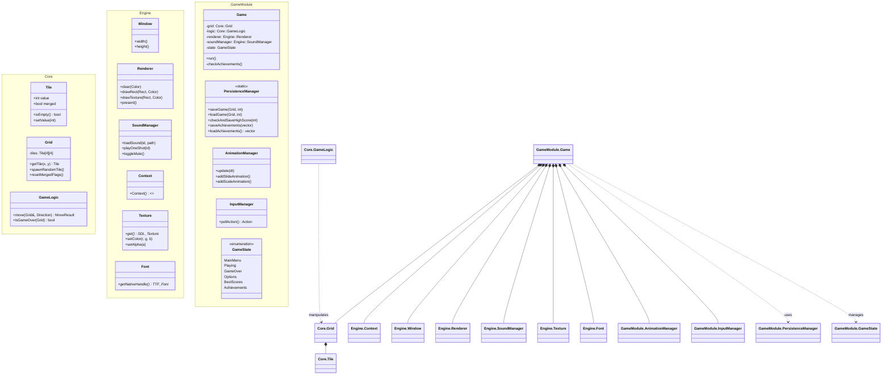

# Tile Twister - Architecture & Design

## 1. Architectural Philosophy
We follow a **Clean Architecture** approach with a strict **Model-View-Controller (MVC)** separation.
*   **Core (Model)**: Pure C++ logic. Knows *nothing* about SDL or rendering.
*   **Engine (View Wrapper)**: High-level C++ wrappers around low-level SDL C APIs.
*   **Game (Controller)**: The glue that binds input, logic, and rendering.

### Why this approach?
1.  **Testability**: We can test the entire game logic (merging, sliding, game over) without opening a window.
2.  **Portability**: The logic code is standard C++ and works on any machine.
3.  **Maintainability**: Changing the graphics library (e.g., SDL2 to SFML) only affects the `Engine` module, not the game rules.

---

## 2. Module Boundaries

### A. Core Module (`src/core/`)
**Responsibility**: Defines the state of the 2048 board and rules of the game.
**Dependencies**: Standard Library only. **NO SDL**.

Key Components:
*   `Tile`: Represents a single cell (Value, MergedStatus).
*   `Grid`: A 4x4 matrix of Tiles. Handles "physical" storage.
*   `GameLogic`: Stateless functional helpers that execute moves and determine game over.

### B. Engine Module (`src/engine/`)
**Responsibility**: RAII wrappers for SDL resources (Graphics, Audio, Input).
**Dependencies**: `SDL2`, `SDL2_ttf`, `SDL2_mixer`, `SDL2_image`.

Key Components:
*   `Window`: Manages `SDL_Window`.
*   `Renderer`: Manages `SDL_Renderer`, Textures, and Fonts.
*   `SoundManager`: Manages `SDL_mixer` chunks, specific channels, and procedural audio assets.
*   `Context`: Aggregates Engine subsystems for easy passing.

### C. Game Module (`src/game/`)
**Responsibility**: The Application Loop, UI/UX, and State Management.
**Dependencies**: `Core`, `Engine`.

Key Components:
*   `Game`: The main class. Orchestrates the Finite State Machine (Menu -> Playing -> GameOver).
*   `AnimationManager`: Handles visual transitions (Sliding tiles, Pop effects).
*   `PersistenceManager`: Static helper for saving/loading Game State, Leaderboards, and Achievements to disk.
*   `InputManager`: Maps raw inputs to high-level Game Actions.

---

## 3. Class Diagram

---

## 4. Design Decisions & Rationale

### Persistence Strategy
*   **Format**: Simple Text/Line-based serialization.
*   **Why?**: JSON or XML were considered overkill for such small state data. Custom parsing is faster and requires no external dependencies (like nlohmann/json), keeping the build lightweight.

### Audio System
*   **Procedural Generation**: Instead of committing large binary `.wav` files, we use a Python script (`generate_sounds.py`) to synthesize sound effects mathematically during development.
*   **Engine Integration**: `SoundManager` handles channel allocation (16 channels) to ensure critical sounds (Achievements) are never cut off by rapid gameplay effects.

### Architecture: Value Semantics
We prioritize **Value Semantics** for `Tile` and `Grid`:
*   *Why?* A `Tile` is tiny (int + bool). Allocating it on the heap (`new Tile`) causes cache misses. Storing them in a contiguous `std::array` is extremely CPU cache-friendly.

---

## 6. Appendix: Clean Architecture Mapping
This project adapts **Robert C. Martin's (Uncle Bob) Clean Architecture** (the "Onion Architecture") to a game context.

### The Dependency Rule ("The Concentric Circles")
The core rule is: **Source code dependencies must only point inward.**
Imagine a series of concentric circles:

1.  **Inner Circle (Entities)**: `src/core/Tile`, `Grid`. Pure data. They don't know "Games" or "Screens" exist.
2.  **Use Cases**: `src/core/GameLogic`. Orchestrates the entities. Knows rules like "merging". Knows *nothing* about the screen.
3.  **Interface Adapters**: `src/engine/Input`. Adapts the outside world (SDL) to our inner world (enums).
4.  **Frameworks & Drivers**: SDL2, OpenGL. We keep this at arm's length.

### Why this is "Clean"? (Dirty vs. Clean)

**In a "Dirty" Architecture:**
Your `Tile` class might have a method `draw()`, which calls `SDL_RenderCopy`.
*   **Problem**: `Tile` now depends on `SDL2`. You can't test `Tile` logic without a graphics window.
*   **Problem**: To switch to a text-based UI, you have to rewrite `Tile`.

**In our Clean Architecture:**
*   `Tile` holds data.
*   `Renderer` (Adapter) looks at `Tile` and decides how to draw it.
*   **Result**: We can swap `Renderer` for an `AsciiRenderer` and the entire core game logic remains 100% untouched.

### Layer Mapping Table
| Clean Arch Layer | Concepts | Our Module | Description |
| :--- | :--- | :--- | :--- |
| **Entities** | Enterprise Rules | `src/core/Tile`, `Grid` | Raw data structures. Zero usage of SDL. |
| **Use Cases** | App Rules | `src/core/GameLogic` | The rules of 2048 (Merging, Scoring). |
| **Adapters** | Adapters | `src/engine/Input` | SDL_Event -> Game Enum. |
| **Frameworks** | Details | SDL2, Disk I/O | The raw IO and Persistence. |
